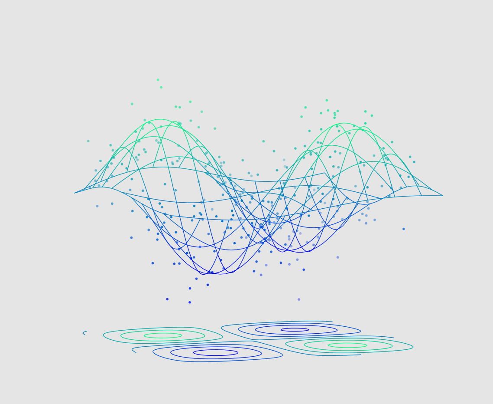
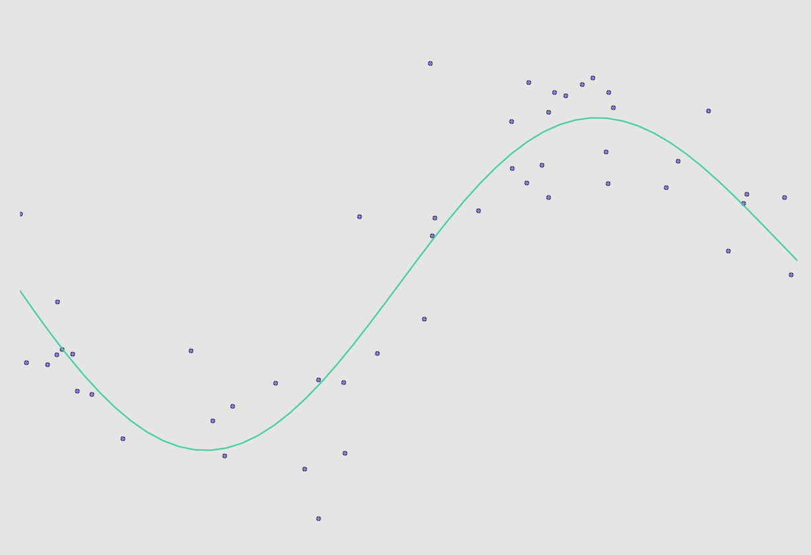

**cpp-rbf** is linearly parameterized Gaussian Radial Basis Function approximator written in C++.

Example approximation to two-dimensional sin with Gaussian noise (sd=0.3) with 300 uniform random samples:

Example approximation to sin with Gaussian noise (sd=0.3):

# Introduction
Gaussian Radial Basis Function approximator is a parametric approximator for smooth functions. It is especially useful when one needs to approximate smooth function from noisy observations.

For input $x$, the approximation is given by

$y(x) = \sum\limits_{i=1}^{N} w_i \phi(||x-c_i||),$

where $N$ is the number of radial basis centroids $c_i$, $w_i$ are the weights, $\phi$ is the basis function and the norm is usually taken to be the Euclidean distance.

The centroids $c_i$ are equally spaced points in the input space where the basis functions are centered.

While other basis functions can be used, the Gaussian density is a popular choice for continuous function approximation. The Gaussian density is given by

$\phi(r) = e^{(-\gamma r)^2}, \ \ \text{for} \ r=||x-c_i||,$ 

where $\gamma$ is a scaling factor. While this basis function is nonlinear, the approximator is linear in the weights $w_i$ and so the solution can be approximated with linear least-squares.

# Installation
`cpp-rbf` is a header-only library and uses some c++11 features.

## Dependencies
* [Armadillo](http://arma.sourceforge.net) for linear algebra.

For plotting the example plots, you also need

* Python + numpy + [matplotlib](http://matplotlib.org/)

## Compilation
To run the example [examples/testrbf.cpp](examples/testrbf.cpp) that approximates 2d and 3d sin(),

1. Edit the [makefile](Makefile) to include the location of Armadillo headers and library.
2. Run `make` in the project root directory.

# Example
See [examples/testrbf.cpp](examples/testrbf.cpp).

# License

**cpp-rbf** is made available under the terms of the GPLv3.

See the LICENSE file that accompanies this distribution for the full text of the license.
